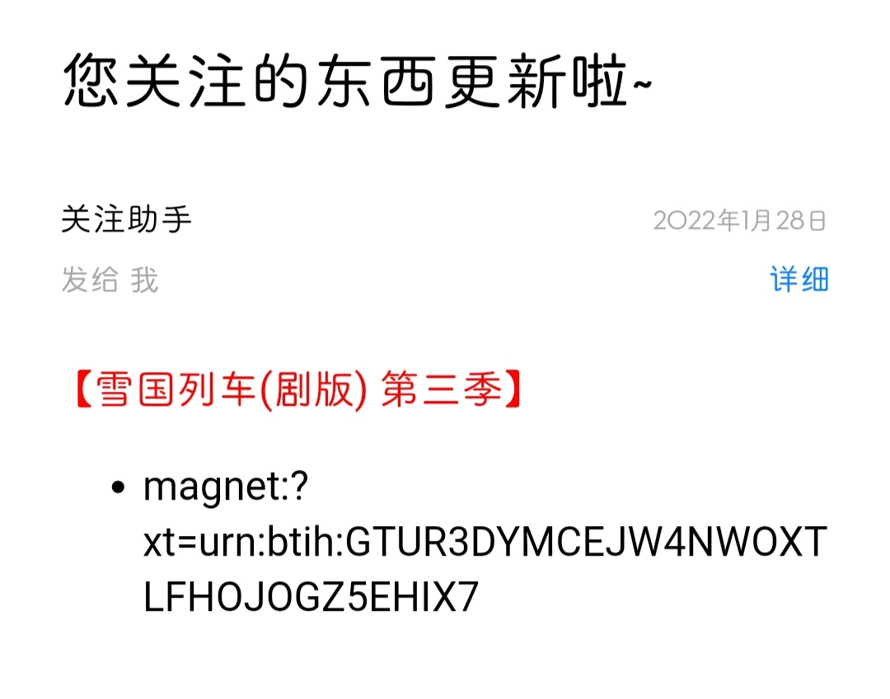

# ChangeDetection
> 监听web或者api内容变更, 该仓库是[花生酱的家庭流媒体](https://github.com/PPeanutButter/HomeMediaServer)的组成部分。


# usage
> 在同级目录下建立任务文件`change_detection_tasks.json`, 其中任务示例如下

# samples
- [BTBTT](#btbtt)
- [B站番剧更新](#blibili)
- [E宝喜加一(Epic)](#epic)
- B站动态 @已失效, Cookie有时效限制
- [DDNS](#ddns)

## btbtt
```json
[
    {
        "title": "雪国列车(剧版) 第三季",
        "parser": {
            "type": "BTBTTParser", #该名称为解析器名字, 只能是core目录下的一个
            "selector": 6,
            "regex": "AMZN",
            "url": "http://btbtt11.com/thread-index-fid-950-tid-4612833.htm"
        },
        "message": {
            "type": "HTMLMessage" #该名称为消息体名字, 只能是message目录下的一个
        },
        # 下面的字段不填默认为base_tasks.json内的, 如果每个任务的收件人都是一样的可以填写在base_tasks.json中
        "EmailFrom": "xx@qq.com",
        "EmailTo": "xx@outlook.com",
        "EmailPassword": "xxx",
        "SMTP_SSL": "smtp.qq.com"
    },
]
```

## blibili
```json
{
    "title": "高木同学 第3季",
    "parser": {
        "type": "SimpleJsonParser",
        "selector": "$.result[*].episodes[?(@.title=='擅长捉弄的高木同学 第三季')].pub_index",
        "url": "https://api.bilibili.com/pgc/web/timeline?types=1&before=0&after=0"
    },
    "message": {
        "type": "HTMLMessage"
    }
}
```

## epic
```json
{
    "title": "E宝喜加一",
    "parser": {
        "type": "SimpleJsonParser",
        "selector": "$.data.Catalog.searchStore.elements[?(@.promotions.promotionalOffers)].title",
        "regex": ".*", # 缺失默认为.*
        "url": "https://store-site-backend-static-ipv4.ak.epicgames.com/freeGamesPromotions?locale=zh-CN&country=CN&allowCountries=CN"
    },
    "message": {
        "type": "HTMLMessage"
    }
}
```

## bilibili-p
> 监听你的B站动态, 筛选出你感兴趣的并通知 (重写了两个部分)：


```json
{
    "title": "B站动态",
    "parser": {
        "type": "BilibiliParser",
        "selector": "$.data.cards[*].card",
        "regex": "高木同学|逗川|鲁大能", # 筛选感兴趣的
        "cookie": "", # 从浏览器获取
        "url": "https://api.vc.bilibili.com/dynamic_svr/v1/dynamic_svr/dynamic_new?type_list=8,512,4097,4098,4099,4100,4101"
    },
    "message": {
        "type": "BilibiliMessage"
    }
}
```

## ddns
> 前往 dynv6 申请免费域名
```json
{
    "title": "电脑DDNS",
    "parser": {
        "type": "DDNSParser",
        "protocol": "dyndns2",
        "server": "dynv6.com",
        "password": "",
        "domain": "",
        "regex": "" # 网卡名，如以太网
    },
    "message": {
        "type": "CQMessage"
    }
}
```

# 二次开发
示例一[B站动态](bilibili-p)：
BilibiliParser, 重写JSONParser支持高级HTTP请求和图片消息：
```python
import json

import Registry
from .JSONParser import JSONParser
from hcy.HCY import HCYRequest


@Registry.register_module
class BilibiliParser(JSONParser):
    def __init__(self, url, selector, cookie, regex='.*'):
        self.regex = regex
        self.hcy = HCYRequest(url=url, method='GET', base_headers='hcy/bilibili.hcy', cookie=cookie)
        super(BilibiliParser, self).__init__(self.hcy.request().text, selector)

    def get_id(self, selected):
        selected = json.loads(selected)
        owner_name = selected['owner']['name'] if 'owner' in selected else selected['apiSeasonInfo']['title']
        title = selected['title'] if 'title' in selected else selected['new_desc']
        return owner_name+title

    def get_name(self, selected):
        selected = json.loads(selected)
        owner_name = selected['owner']['name'] if 'owner' in selected else selected['apiSeasonInfo']['title']
        title = selected['title'] if 'title' in selected else selected['new_desc']
        cover = selected['pic'] if 'pic' in selected else selected['cover']
        return f'<h3>{owner_name}</h3>'+title+f'\n\n' if cover else ""
```
重写BilibiliMessage优化图片显示, 当然可以用CSS(确保你邮件客户端支持)：
```python
import Registry
from .BaseMessage import BaseMessage


@Registry.register_module
class BilibiliMessage(BaseMessage):
    def __init__(self):
        self.head = """<!DOCTYPE html><html lang="en"><head><meta charset="UTF-8"><title>Title</title></head><body>"""
        self.content_join = """\n"""
        self.tail = """</body></html>"""
        super(BilibiliMessage, self).__init__()

    def build_head(self):
        return self.head

    def build_content(self, content_list):
        return self.content_join.join(content_list)

    def build_tail(self):
        return self.tail
```
示例二[BTBTT](#btbtt)：
若需要http认证请通过继承`JSONParser`或者`CSSParser`重写相关函数即可, 否则可以继承封装了http请求的`Simple*Parser`来简化. 如`BTBTTParser`实现了直接通知磁力链接而不是通知标题，代码如下:
```python
import os
import urllib.parse

from .CSSParser import CSSParser


class BTBTTParser(CSSParser):
    def __init__(self, url, selector, regex='.*'):
        self.url = url
        self.selector = self.build_selector(selector)
        self.regex = regex
        super(BTBTTParser, self).__init__(self.get(self.url), self.selector)

    def get_id(self, selected):
        return selected.text
    
    # 返回self.get_id(selected) 就是通知标题，下面代码实现了转磁力的功能，其中用到了我的bt2magnet库
    def get_name(self, selected):
        ori_url = urllib.parse.urlparse(self.url)
        if selected.name == 'a' and str(selected.text).endswith('.torrent'):
            download_url = f"{ori_url.scheme}://{ori_url.hostname}/{selected.attrs['href']}"\
                .replace("-dialog-", "-download-")
            return os.popen(f'bt2magnet "{download_url}"').read().strip('\n')
        else:
            return self.get_id(selected)

    @staticmethod
    def build_selector(selector):
        if isinstance(selector, int):
            return f"div#body table:nth-child({selector}) div.attachlist a"
        else:
            return selector

```
